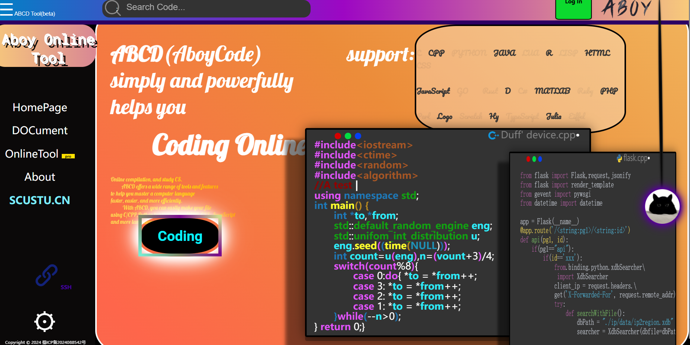
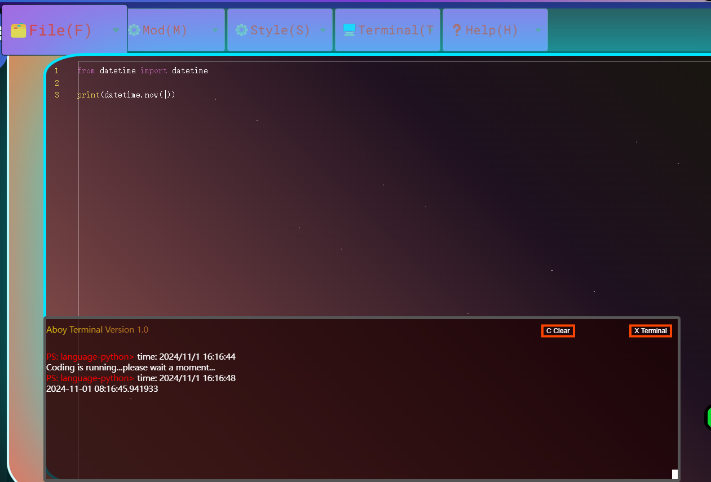

# OpenCodingOnline

## WHAT IS THIS?

 Online compilation, and study CS.  &emsp;&emsp;ABCD offers a wide range of tools and features  to help you master a computer language  faster, easier, and more efficiently. &emsp;&emsp; With ABCD, you can easily make your file  using C/CPP,Python,lua,lisp,go,javaHTML, CSS, JavaScript and more languages

## **PROGRAM IS SO EASY**

